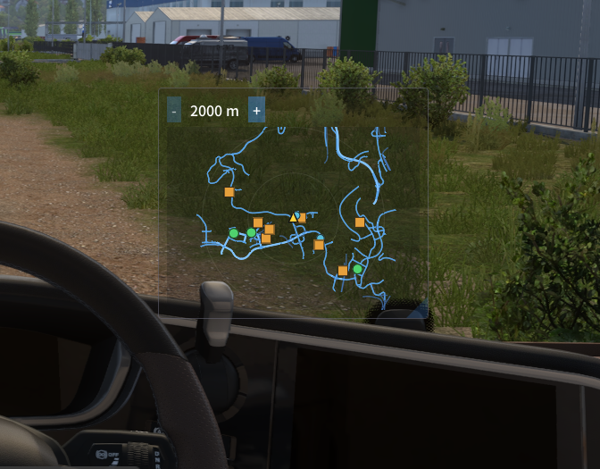
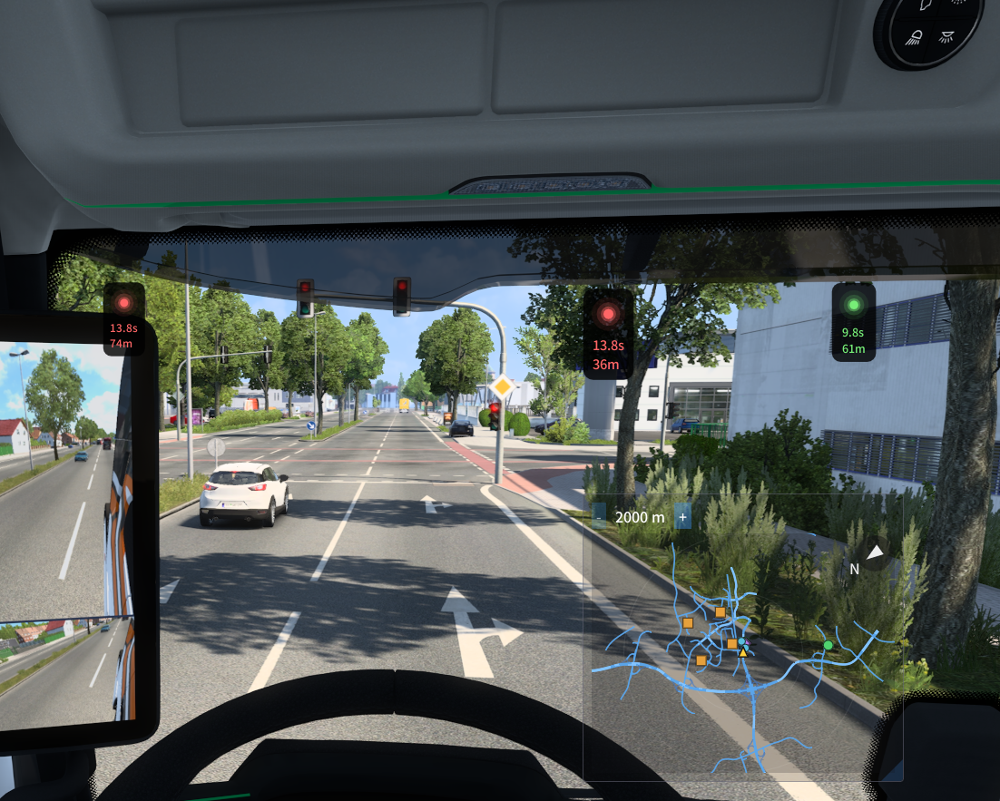

# NavMap

English | [日本語](README.ja.md)

NavMap is an [ETS2LA](https://github.com/ETS2LA/ETS2LA) plugin that shows a 2D navigation map for Euro Truck Simulator 2 and American Truck Simulator in the ETS2LA Overlay.

It draws the route the game's own navigation has already planned. NavMap does not calculate a route itself. When the game recalculates the route or you change the destination, the map updates to match.

## Features



- Heading-up map: your truck stays in the center and the map turns so the direction you're driving points up
- Nearby roads, drawn lane by lane
- The game's active route, highlighted in green
- A destination marker, or an arrow at the map edge when the destination is off-screen
- A small compass that points north
- Icons for companies, gas stations, service points and garages (only shown when ETS2LA's data fidelity is set to Extreme)
- `-` / `+` zoom buttons to show 500 m, 1000 m, 1500 m or 2000 m across the map
- A map window you can move anywhere on screen and resize freely
- AR markers on every traffic light within 150 m, drawn at the light's position and showing its color, remaining time and distance (merged from the SignalHUD plugin)



## Settings

Open **Plugin Manager → NavMap → Adjustments** to change:

- **Background opacity**: how see-through the map window's background is
- **Hide when paused**: closes the map window while the game is paused
- **Traffic signals → Show AR marker**: shows or hides the AR markers on nearby traffic lights
- **Traffic signals → AR marker background opacity**: how see-through the AR marker's black background is (0–100%)
- **Traffic signals → AR marker font size**: text size of the AR marker (50–300%)

This page also has a Diagnostics section. It shows whether telemetry, map data and navigation data are available, which helps when the map looks empty.

NavMap saves your settings and zoom level to `%APPDATA%\ETS2LA\NavMapSettings.json` so they're kept after a restart.

## Install

You don't need to build NavMap yourself to use it.

1. Download the latest `NavMap-vX.Y.Z.zip` from the [Releases page](https://github.com/sunfish0125/NavMap/releases).
2. Close ETS2LA if it's running.
3. Extract `NavMap.dll` and `NavMap.deps.json` from the zip into the `Plugins` folder inside your ETS2LA installation folder (the folder that contains `ETS2LA.exe`). If there's no `Plugins` folder yet, start ETS2LA once and it creates one.
4. Start ETS2LA and enable **NavMap** in Plugin Manager.
5. Start ETS2 or ATS and set a destination in the game's navigation. The route then appears on the map.

Each release is built against a specific ETS2LA commit, which the release notes list. If a newer ETS2LA changes its plugin API, NavMap may fail to load until a new NavMap release comes out.

To update NavMap, close ETS2LA, replace the two files with the ones from the new release, and start ETS2LA again.

## Building from source

### Requirements

- Windows
- [.NET 10 SDK](https://dotnet.microsoft.com/download)
- A local copy of the [ETS2LA](https://github.com/ETS2LA/ETS2LA) C# source, placed in a folder next to this repository
- ETS2 or ATS, set up to work with ETS2LA

### Folder layout

NavMap builds against the ETS2LA source, so both folders must sit side by side:

```text
<workspace>\
├─ ETS2LA\          ETS2LA source (contains ETS2LA\ETS2LA.csproj)
└─ NavMap\          this repository
```

### Build and install

Run the build script from the `NavMap` folder:

```powershell
.\scripts\build-and-deploy.ps1
```

The script:

1. builds `NavMap.csproj`
2. copies `NavMap.dll` and `NavMap.deps.json` into `..\ETS2LA\ETS2LA\bin\<Configuration>\net10.0\Plugins`

If the build fails, the script stops without copying any files.

#### Options

| Option | Description |
| --- | --- |
| `-Configuration Debug` / `-Configuration Release` | Build configuration. The default is `Debug`. The files are copied to the ETS2LA build output for the same configuration. |
| `-SkipBuild` | Skip the build and copy the existing build output only. |
| `-IncludeSymbols` | Also copy `NavMap.pdb` for debugging. |

Example:

```powershell
.\scripts\build-and-deploy.ps1 -Configuration Release
```

If PowerShell blocks the script because of the execution policy, run it this way instead:

```powershell
powershell -ExecutionPolicy Bypass -File .\scripts\build-and-deploy.ps1
```

#### After deploying

1. If ETS2LA is already running, close it completely. ETS2LA only loads the new plugin files when it starts, so disabling and re-enabling NavMap in Plugin Manager does not pick up the update.
2. Start the ETS2LA build that matches the configuration you deployed to.
3. Enable **NavMap** in Plugin Manager.
4. Start ETS2 or ATS and set a destination in the game's navigation. The route then appears on the map.

Repeat these steps every time you build and deploy a new version.

## Releasing

Releases are built by GitHub Actions ([.github/workflows/release.yml](.github/workflows/release.yml)).

1. Update `Version` in `Program.cs` (for example `0.2.0`) and commit it.
2. Create a tag that matches it with a `v` prefix, and push the tag:

   ```powershell
   git tag v0.2.0
   git push origin v0.2.0
   ```

3. The workflow checks out ETS2LA at the commit set in `ETS2LA_REF`, builds NavMap in Release mode, and creates a GitHub Release with `NavMap-v0.2.0.zip` attached.

If the tag doesn't match `Version` in `Program.cs`, the workflow stops without creating a release.

To try a build without releasing, run the workflow manually from the **Actions** tab. It uploads the zip contents as a workflow artifact instead.

To build against a newer ETS2LA, change `ETS2LA_REF` in the workflow to the new commit. Check that NavMap still works with that ETS2LA version before you release.

## Known limitations

- The map only appears while game telemetry is live and ETS2LA has finished loading the map data.
- If the game's navigation has no route, NavMap shows roads only.
- NavMap also shows roads your truck can't enter, not only roads it can drive on.
- Even when a destination is set in the game's navigation, the green route line sometimes doesn't appear.
- The north direction used by the compass hasn't been checked against the game yet, so it may point the wrong way.
- Every traffic light within 150 m gets a marker, including lights for crossing roads and oncoming traffic. NavMap doesn't try to work out which light applies to your lane.
- AR markers shrink with distance, but only down to 40% of full size, so far-away markers look larger than true perspective would make them.
- NavMap can only mark traffic lights the game sends to ETS2LA. The Diagnostics section shows how many it received and how far away the nearest one is.
